# Plot gallery

A visual reference for every plot type in mSigPlot.

``` r
library(mSigPlot)
orders <- catalog_row_order()
```

## SBS96

``` r
plot_SBS96(catalog_sbs96, plot_title = "SBS96")
```

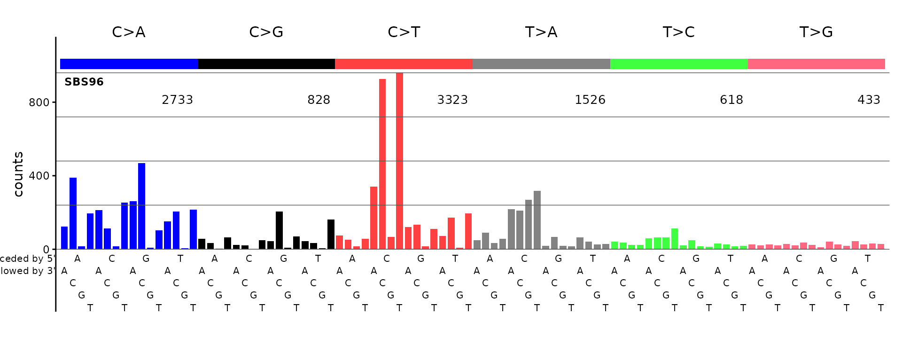

## SBS192

``` r
plot_SBS192(catalog_sbs192, plot_title = "SBS192")
```

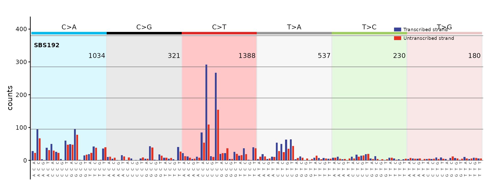

## SBS288

``` r
plot_SBS288(sbs288_df[, 1, drop = FALSE], plot_title = "SBS288A")
#> Scale for y is already present.
#> Adding another scale for y, which will replace the existing scale.
#> Scale for y is already present.
#> Adding another scale for y, which will replace the existing scale.
#> Scale for y is already present.
#> Adding another scale for y, which will replace the existing scale.
```

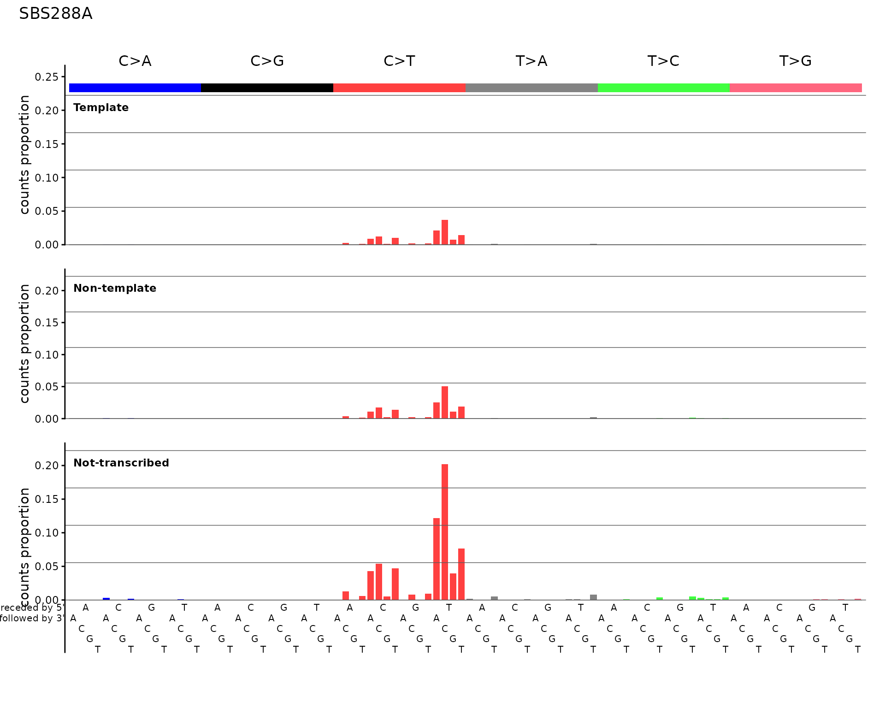

## SBS12

``` r
plot_SBS12(catalog_sbs192, plot_title = "SBS12 strand bias")
```

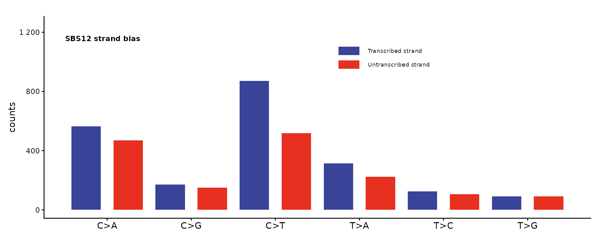

## SBS1536

``` r
plot_SBS1536(catalog_sbs1536, plot_title = "SBS1536")
```

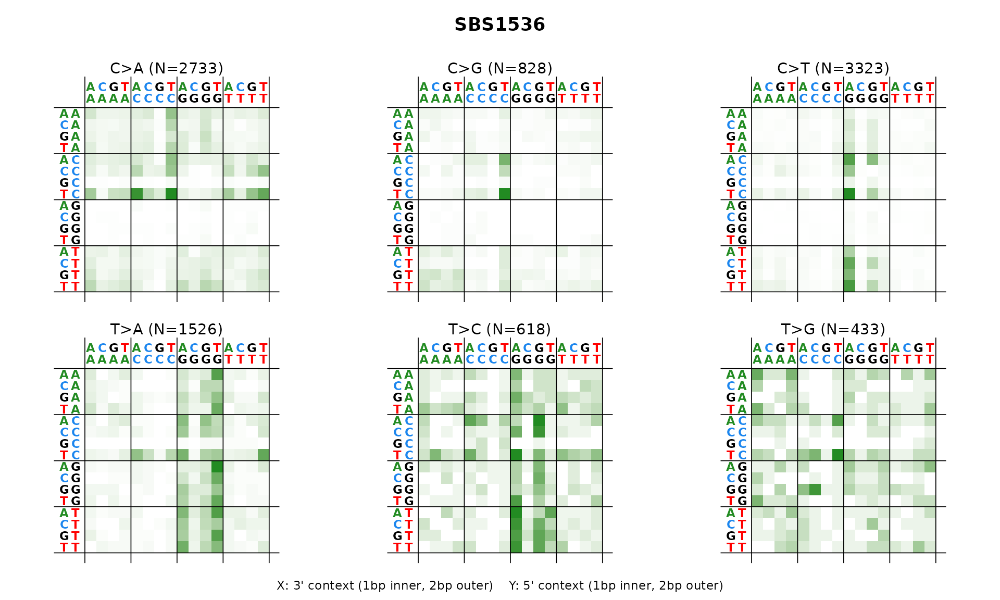

## DBS78

``` r
plot_DBS78(catalog_dbs78, plot_title = "DBS78")
```

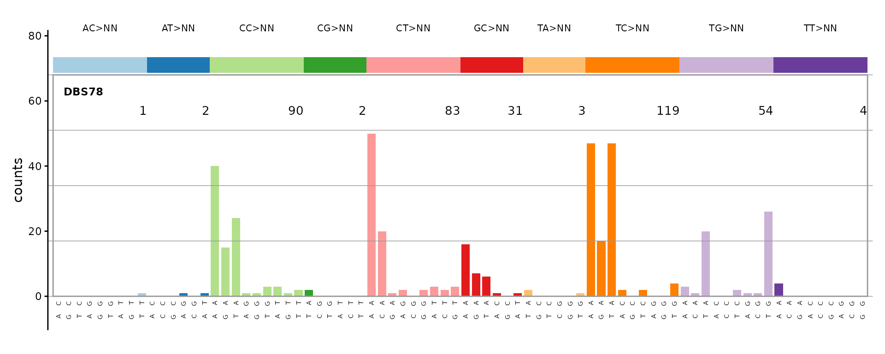

## DBS144

``` r
plot_DBS144(catalog_dbs144, plot_title = "DBS144")
```

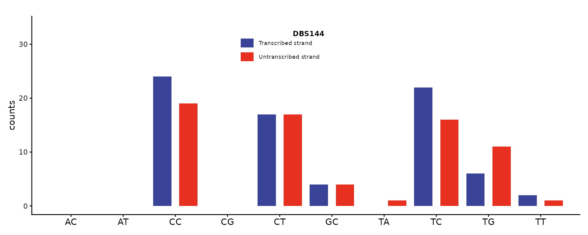

## DBS136

``` r
plot_DBS136(dbs136_df[, 1, drop = FALSE], plot_title = "DBS136")
```

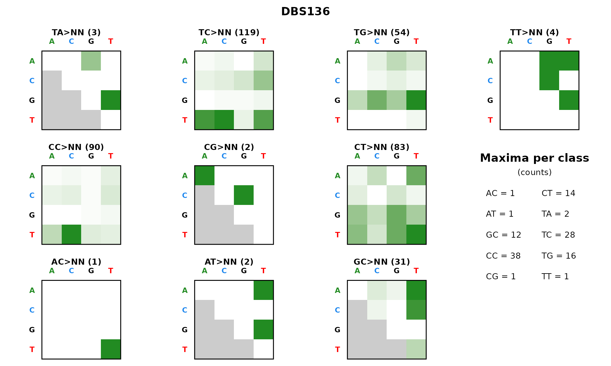

## ID83

``` r
plot_ID83(id83_sigs[, "ID1", drop = FALSE], plot_title = "ID83 (COSMIC ID1)")
```

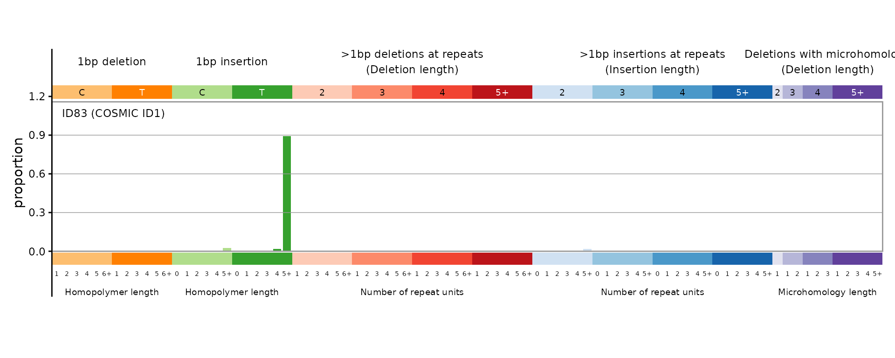

## ID89

``` r
plot_ID89(id89_sigs[, 1, drop = FALSE], plot_title = "ID89")
```

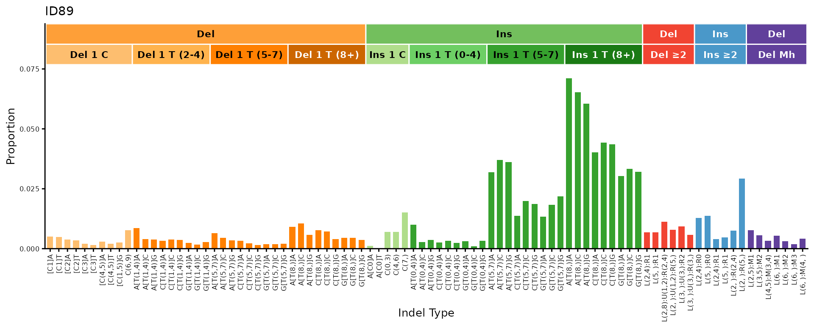

## ID166

``` r
plot_ID166(sig_id166, plot_title = "ID166 (simulated)")
```

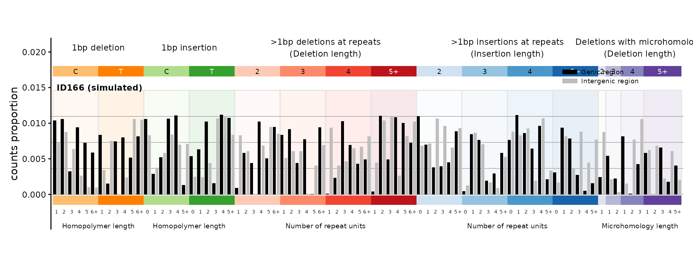

## ID476

``` r
plot_ID476(id476_sigs[, 1, drop = FALSE], plot_title = "ID476")
```

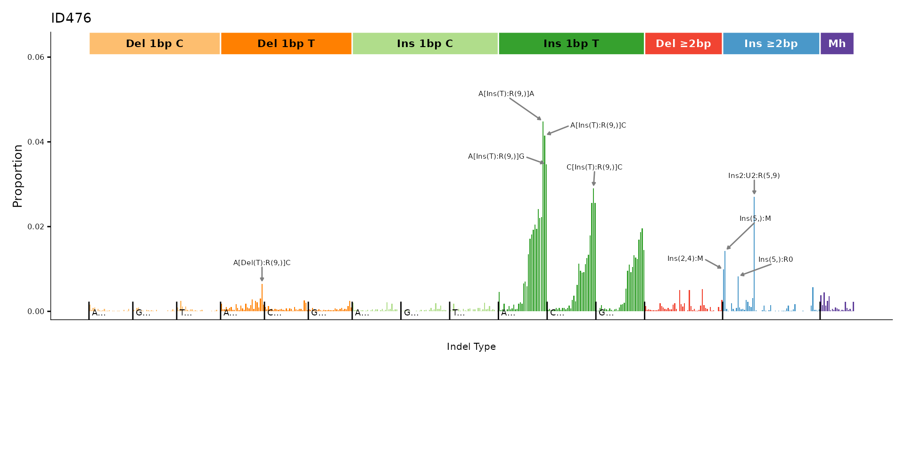

## ID476 right panel

``` r
plot_ID476_right(id476_sigs[, 1, drop = FALSE], plot_title = "ID476 right panel")
```

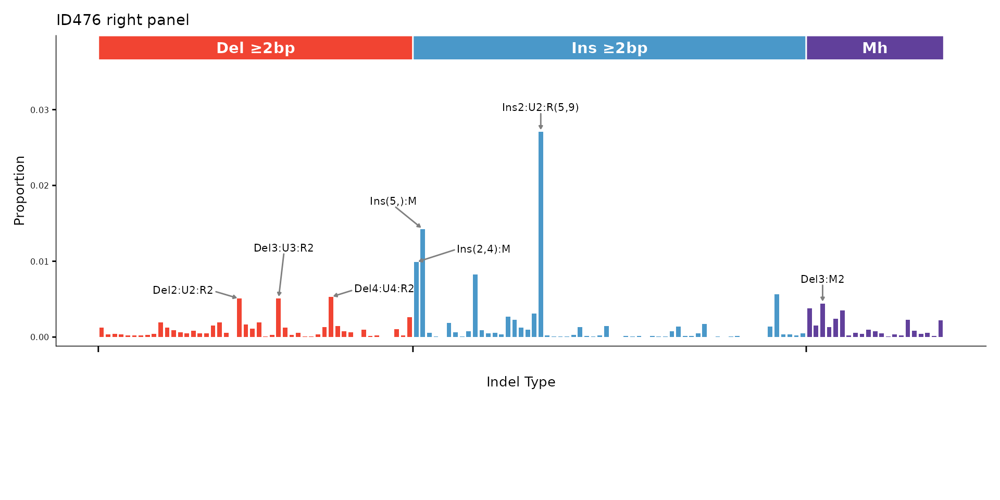
