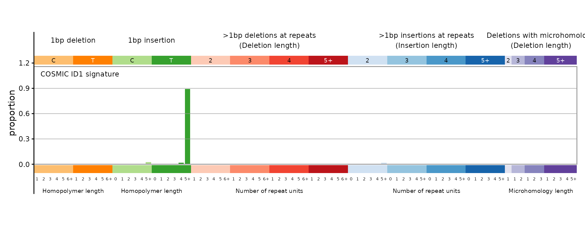
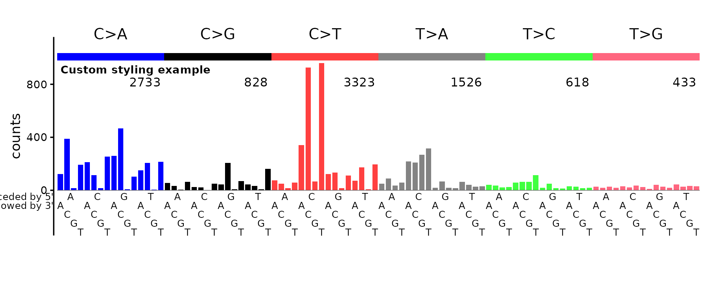
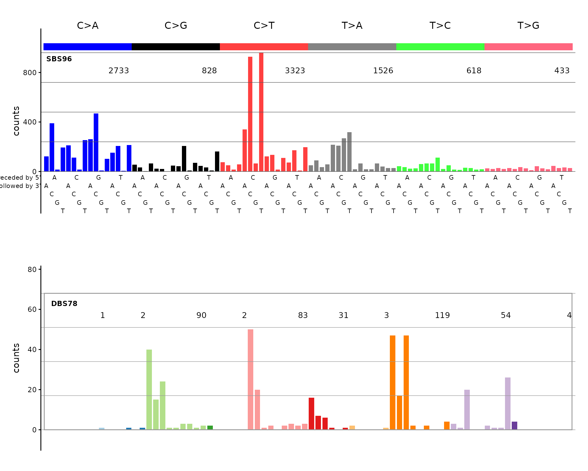

# Plotting mutational signatures with mSigPlot

## Introduction

mSigPlot creates publication-quality plots for mutational signatures and
mutational spectra. It supports SBS (single base substitution), DBS
(doublet base substitution), and indel catalogs across 10 classification
systems.

``` r
library(mSigPlot)
```

## Loading catalog data

mSigPlot works with numeric vectors, data frames, matrices, tibbles, and
data.tables. Here we load three example catalogs bundled with the
package.

### SBS96 catalog

The 96-channel SBS catalog has one row per trinucleotide mutation
context. The bundled example contains mutation counts from four HepG2
samples.

``` r
sbs96_file <- system.file("extdata", "sbs96_example.csv", package = "mSigPlot")
sbs96_df <- read.csv(sbs96_file)

# Build a named catalog: row names are the 96 canonical trinucleotide types
orders <- catalog_row_order()
catalog_sbs96 <- data.frame(
  sample1 = sbs96_df[, 3],
  row.names = orders$SBS96
)

head(catalog_sbs96)
#>      sample1
#> ACAA     123
#> ACCA     390
#> ACGA      15
#> ACTA     194
#> CCAA     212
#> CCCA     113
```

### DBS78 catalog

The 78-channel DBS catalog covers all doublet base substitution classes.

``` r
dbs78_file <- system.file("extdata", "dbs78_example.csv", package = "mSigPlot")
dbs78_df <- read.csv(dbs78_file)

catalog_dbs78 <- data.frame(
  sample1 = dbs78_df[, 3],
  row.names = paste0(dbs78_df$Ref, dbs78_df$Var)
)

head(catalog_dbs78)
#>      sample1
#> ACCA       0
#> ACCG       0
#> ACCT       0
#> ACGA       0
#> ACGG       0
#> ACGT       0
```

### ID83 catalog (COSMIC signatures)

The 83-channel indel catalog uses the COSMIC classification. This file
contains COSMIC v3.5 reference signatures; each column is a signature.

``` r
id83_file <- system.file("extdata", "id83_cosmic_v3.5.tsv", package = "mSigPlot")
id83_sigs <- read.table(id83_file, header = TRUE, sep = "\t",
                         row.names = 1, check.names = FALSE)

# Pick one signature to plot
catalog_id83 <- id83_sigs[, "ID1", drop = FALSE]
head(catalog_id83)
#>                     ID1
#> DEL:C:1:0  1.598890e-04
#> DEL:C:1:1  7.735230e-04
#> DEL:C:1:2  3.310000e-18
#> DEL:C:1:3  1.907613e-03
#> DEL:C:1:4  7.059900e-04
#> DEL:C:1:5+ 3.370115e-03
```

## Plotting individual catalogs

### SBS96

``` r
plot_SBS96(catalog_sbs96, plot_title = "HepG2 sample — SBS96")
```


### DBS78

``` r
plot_DBS78(catalog_dbs78, plot_title = "HepG2 sample — DBS78")
#> Warning: Removed 10 rows containing missing values or values outside the scale range
#> (`geom_text()`).
#> Warning: Removed 78 rows containing missing values or values outside the scale range
#> (`geom_text()`).
#> Removed 78 rows containing missing values or values outside the scale range
#> (`geom_text()`).
```


### ID83

``` r
plot_83(catalog_id83, plot_title = "COSMIC ID1 signature")
```



## Customizing plots

All plot functions accept parameters to control appearance:

``` r
plot_SBS96(
  catalog_sbs96,
  plot_title = "Custom styling example",
  base_size   = 14,
  show_counts = TRUE,
  grid        = FALSE
)
```



## Auto-dispatch with plot_guess()

If you don’t know (or don’t want to specify) the catalog type,
[`plot_guess()`](https://steverozen.github.io/mSigPlot/reference/plot_guess.md)
detects it from the number of rows:

``` r
plot_guess(catalog_sbs96, plot_title = "Auto-detected SBS96")
```


## Multi-sample PDF export

For batch plotting, every plot function has a `_pdf()` variant that
writes a multi-page PDF with 5 plots per page. The auto-dispatch version
is
[`plot_guess_pdf()`](https://steverozen.github.io/mSigPlot/reference/plot_guess_pdf.md):

``` r
# Build a multi-sample matrix (4 samples)
sbs96_mat <- as.matrix(sbs96_df[, 3:6])
rownames(sbs96_mat) <- orders$SBS96
colnames(sbs96_mat) <- paste0("Sample_", 1:4)

# Write to PDF — 5 plots per page
plot_guess_pdf(sbs96_mat, file.path(tempdir(), "sbs96_samples.pdf"))
```

## Combining plots

Since plot functions return ggplot objects, you can combine them using
packages like `patchwork`:

``` r
if (requireNamespace("patchwork", quietly = TRUE)) {
  library(patchwork)
  p1 <- plot_SBS96(catalog_sbs96, plot_title = "SBS96")
  p2 <- plot_DBS78(catalog_dbs78, plot_title = "DBS78")
  p1 / p2
}
#> Warning: Removed 10 rows containing missing values or values outside the scale range
#> (`geom_text()`).
#> Warning: Removed 78 rows containing missing values or values outside the scale range
#> (`geom_text()`).
#> Removed 78 rows containing missing values or values outside the scale range
#> (`geom_text()`).
```


