# Plotting mutational signatures with mSigPlot

## Introduction

mSigPlot creates publication-quality plots for mutational signatures and
mutational spectra. It supports single base substitutions (SBS), doublet
base substitutions (DBS), and small insertions and deletions (indels)
across 10 classification systems.

``` r
library(mSigPlot)
```

## SBS96 – single base substitutions in trinucleotide context

The 96-channel catalog has one row per trinucleotide mutation context,
organized into 6 mutation classes (C\>A, C\>G, C\>T, T\>A, T\>C, T\>G).
If row names are present they will be checked agains
`catalog_row_order`.

``` r
sbs96_file <- system.file("extdata", "sbs96_example.csv", package = "mSigPlot")
sbs96_df <- read.csv(sbs96_file)
catalog_sbs96 <- data.frame(
  sample1 = sbs96_df[, 3],
  row.names = catalog_row_order()$SBS96
)
plot_SBS96(catalog_sbs96, plot_title = "HepG2 sample -- SBS96")
```

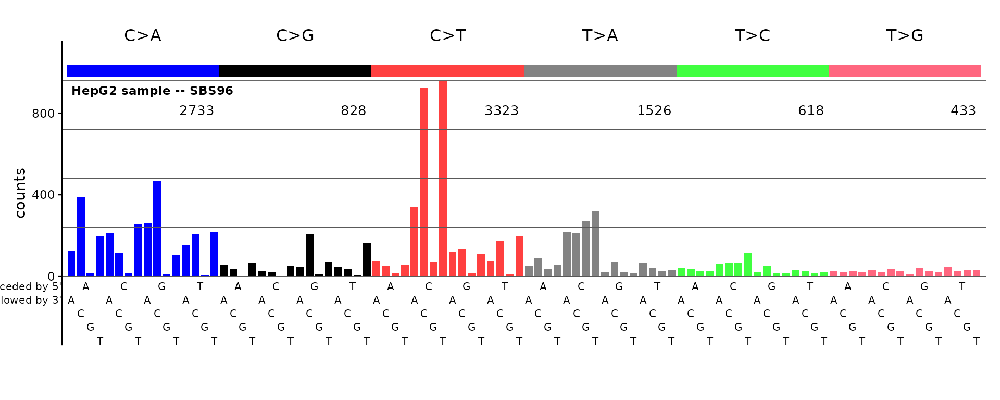

Row names (or for a numeric vector, names) are not required.

If there are no names or row names be sure the rows are in the order
expected for plotting.

``` r
plot_SBS96(sample(sbs96_df[ ,3, drop = TRUE], replace = FALSE), 
  plot_title = "HepG2 sample, mixed up row order -- SBS96")
```

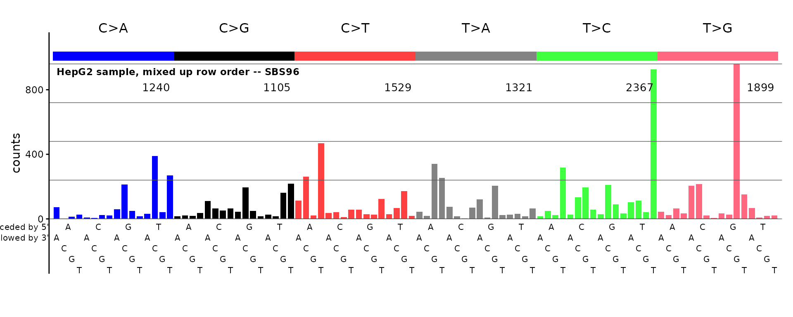

The plot above will be unrecognizable.

## ID83 – COSMIC indel classification

The 83-channel indel catalog uses the COSMIC classification with
single-base and multi-base deletions, insertions, and microhomology
deletions.

``` r
id83_file <- system.file("extdata", "id83_cosmic_v3.5.tsv", package = "mSigPlot")
id83_sigs <- read.table(id83_file, header = TRUE, sep = "\t",
                        row.names = 1, check.names = FALSE)
plot_ID83(id83_sigs[, "ID1", drop = FALSE], plot_title = "COSMIC ID1 signature")
```


## ID89 – 89-channel indel classification

The 89-channel system (Koh et al.) provides a finer decomposition of
indel types, including optional complex indels.

``` r
id89_file <- system.file("extdata", "type89_liu_et_al_sigs.tsv",
                         package = "mSigPlot")
id89_sigs <- read.table(id89_file, header = TRUE, sep = "\t",
                        row.names = 1, check.names = FALSE)
plot_ID89(id89_sigs[, 1, drop = FALSE], plot_title = "ID89 signature")
```

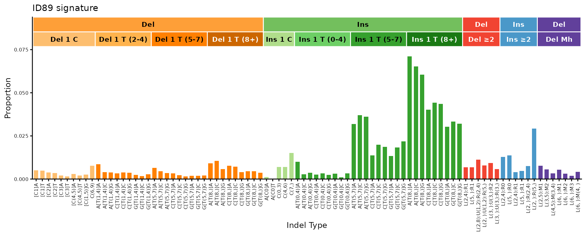

## ID476 – 476-channel indel classification

The 476-channel system adds flanking base context to the indel
classification, producing a detailed profile.

``` r
id476_file <- system.file("extdata", "type476_liu_et_al_sigs.tsv",
                          package = "mSigPlot")
id476_sigs <- read.table(id476_file, header = TRUE, sep = "\t",
                         row.names = 1, check.names = FALSE)
plot_ID476(id476_sigs[, 1, drop = FALSE], plot_title = "ID476 signature")
```

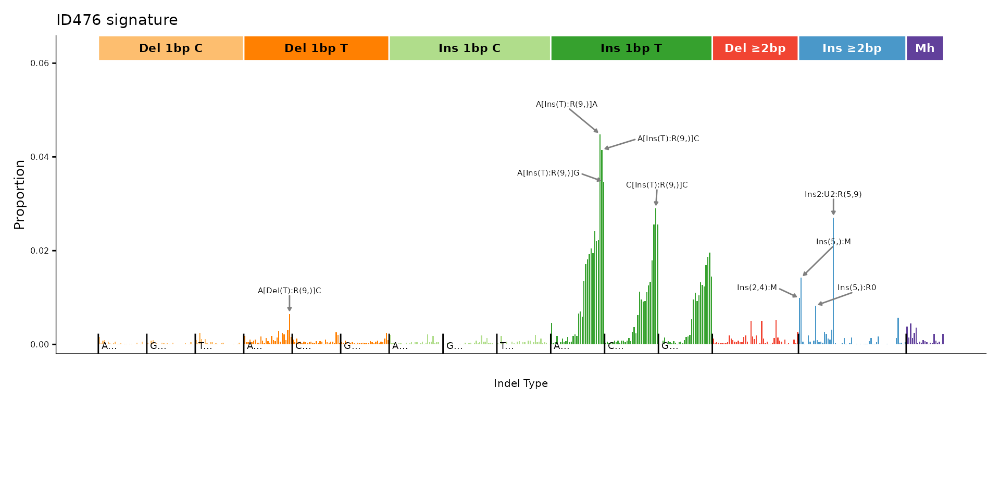

### ID476 right panel

The right portion of the 476-channel profile (positions 343–476) can be
plotted separately for a closer look at multi-base indels.

``` r
plot_ID476_right(id476_sigs[, 1, drop = FALSE],
                 plot_title = "ID476 right panel")
```

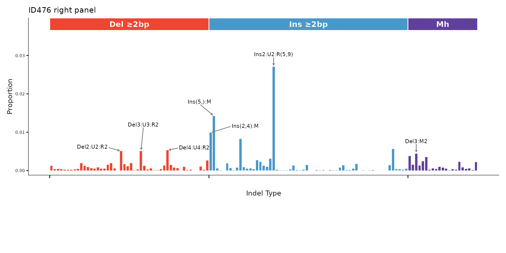

## DBS78 – doublet base substitutions

The 78-channel DBS catalog covers all dinucleotide substitution classes,
organized into 10 reference dinucleotide groups.

``` r
dbs78_file <- system.file("extdata", "dbs78_example.csv", package = "mSigPlot")
dbs78_df <- read.csv(dbs78_file)
catalog_dbs78 <- data.frame(
  sample1 = dbs78_df[, 3],
  row.names = paste0(dbs78_df$Ref, dbs78_df$Var)
)
plot_DBS78(catalog_dbs78, plot_title = "HepG2 sample -- DBS78")
```

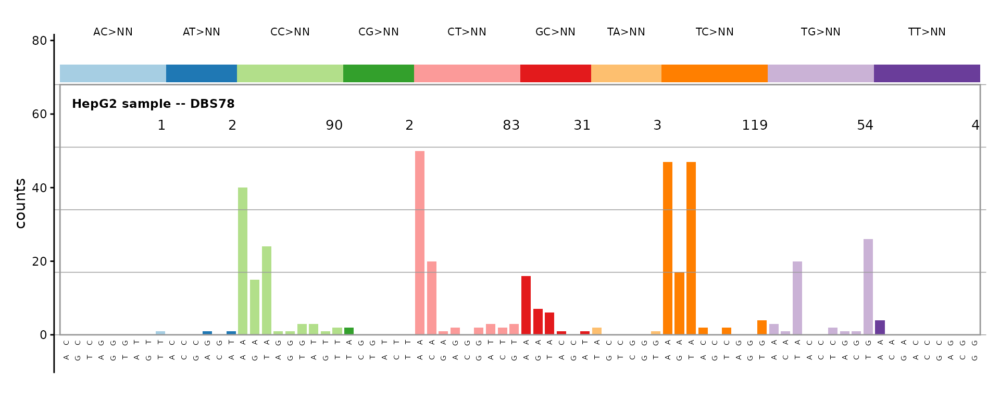

## SBS192 – SBS with transcription strand

The 192-channel catalog pairs each of the 96 trinucleotide contexts with
transcribed and untranscribed strand information.

``` r
sbs192_file <- system.file("extdata", "regress.cat.sbs.192.csv",
                           package = "mSigPlot")
sbs192_df <- read.csv(sbs192_file)
catalog_sbs192 <- data.frame(
  sample1 = sbs192_df[, 4],
  row.names = catalog_row_order()$SBS192
)
plot_SBS192(catalog_sbs192, plot_title = "HepG2 -- SBS192")
```

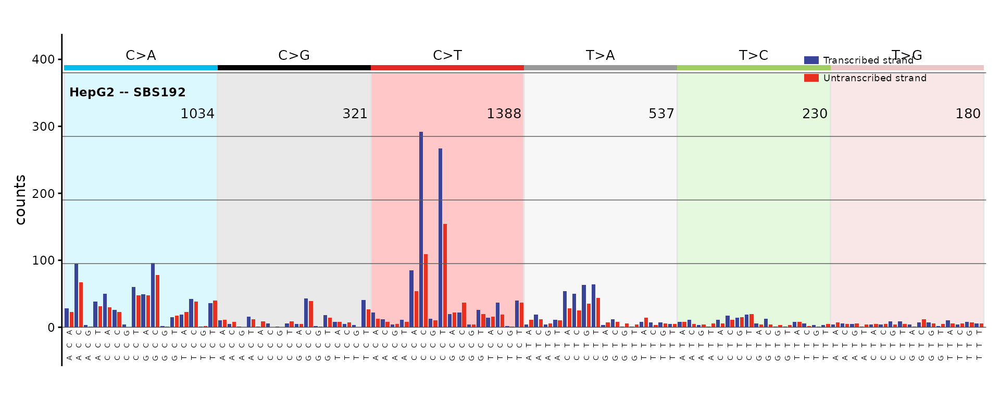

## DBS144 – DBS with transcription strand

The 144-channel DBS catalog adds transcription strand context to the 78
dinucleotide substitution types.

``` r
dbs144_file <- system.file("extdata", "regress.cat.dbs.144.csv",
                           package = "mSigPlot")
dbs144_df <- read.csv(dbs144_file)
catalog_dbs144 <- data.frame(
  sample1 = dbs144_df[, 3],
  row.names = paste0(dbs144_df$Ref, dbs144_df$Var)
)
plot_DBS144(catalog_dbs144, plot_title = "HepG2 -- DBS144")
```

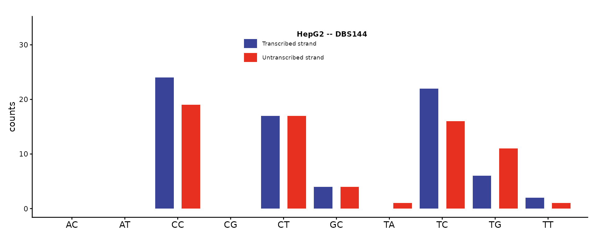

## DBS136 – DBS heatmap

The 136-channel DBS catalog is displayed as a heatmap of 10 panels (4x4
grids) rather than a bar chart.

``` r
dbs136_file <- system.file("extdata", "regress.cat.dbs.136.csv",
                           package = "mSigPlot")
dbs136_df <- read.csv(dbs136_file, row.names = 1)
plot_DBS136(dbs136_df[, 1, drop = FALSE], plot_title = "HepG2 -- DBS136")
```

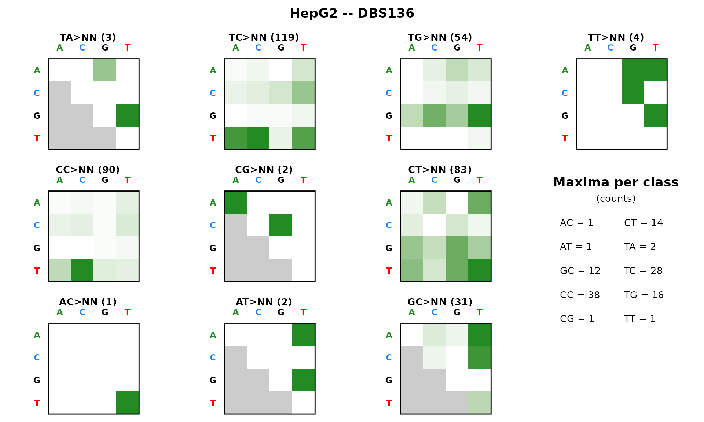

## SBS1536 – SBS pentanucleotide context

The 1536-channel catalog extends trinucleotide context to
pentanucleotide context, displayed as a faceted heatmap.

``` r
sbs1536_file <- system.file("extdata", "regress.cat.sbs.1536.csv",
                            package = "mSigPlot")
sbs1536_df <- read.csv(sbs1536_file)
catalog_sbs1536 <- data.frame(
  sample1 = sbs1536_df[, 3],
  row.names = catalog_row_order()$SBS1536
)
plot_SBS1536(catalog_sbs1536, plot_title = "HepG2 -- SBS1536")
```

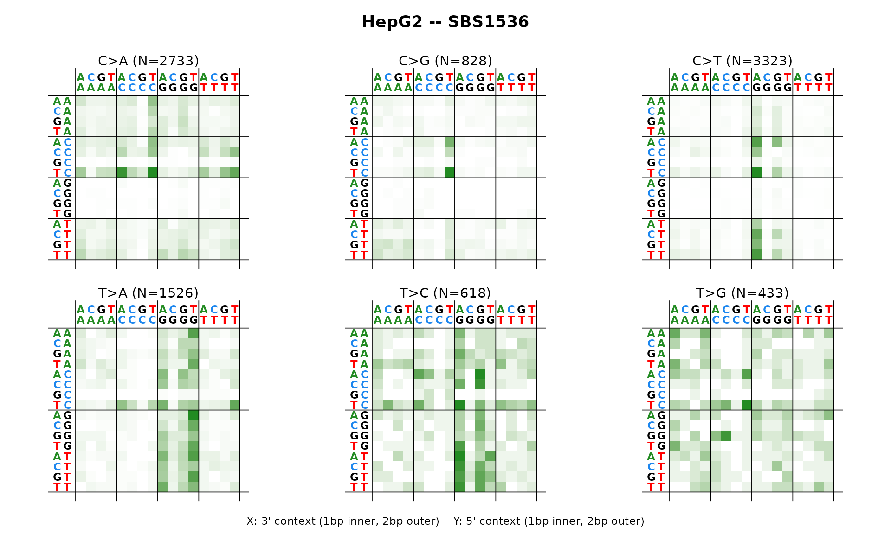

## SBS288 – SBS with three-strand context

The 288-channel catalog adds three strand categories (transcribed,
untranscribed, non-transcribed/intergenic) to the 96 SBS channels.

``` r
sbs288_file <- system.file("extdata", "SBS288_De-Novo_Signatures.txt",
                           package = "mSigPlot")
sbs288_df <- read.table(sbs288_file, header = TRUE, sep = "\t",
                        row.names = 1, check.names = FALSE)
plot_SBS288(sbs288_df[, 1, drop = FALSE], plot_title = "SBS288A")
#> Scale for y is already present.
#> Adding another scale for y, which will replace the existing scale.
#> Scale for y is already present.
#> Adding another scale for y, which will replace the existing scale.
#> Scale for y is already present.
#> Adding another scale for y, which will replace the existing scale.
```

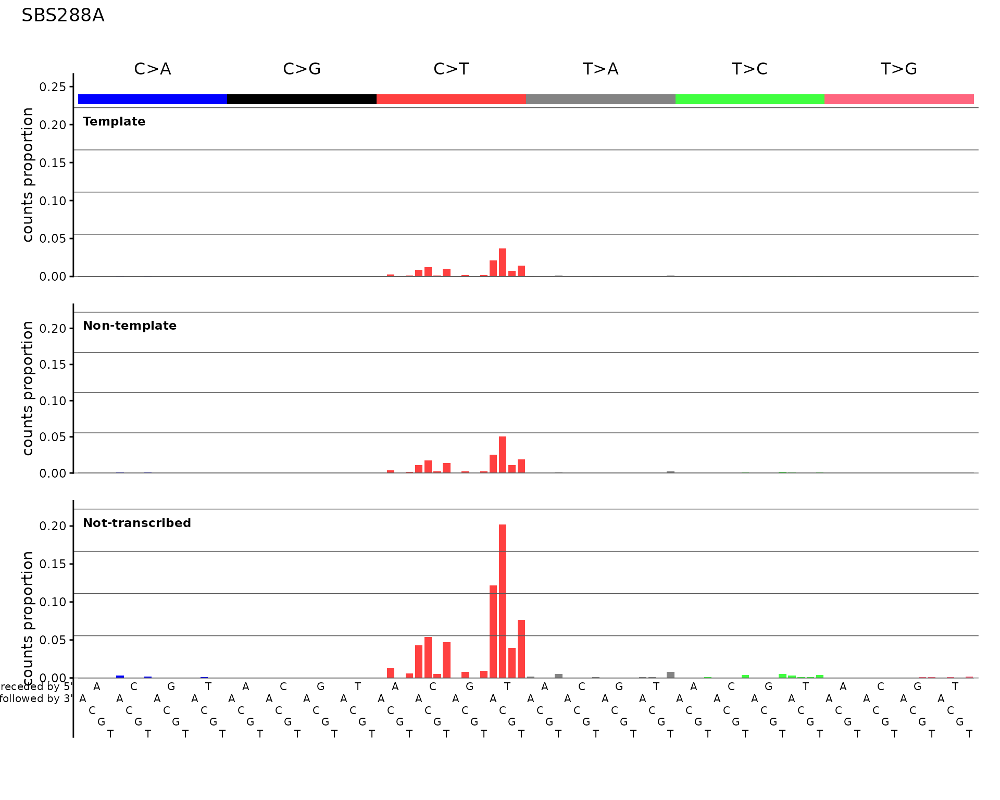

## ID166 – indel genic/intergenic

The 166-channel indel catalog adds genic/intergenic context to the
83-channel COSMIC classification.

``` r
set.seed(42)
sig_id166 <- runif(166)
sig_id166 <- sig_id166 / sum(sig_id166)
names(sig_id166) <- catalog_row_order()$ID166
plot_ID166(sig_id166, plot_title = "Simulated ID166 signature")
```

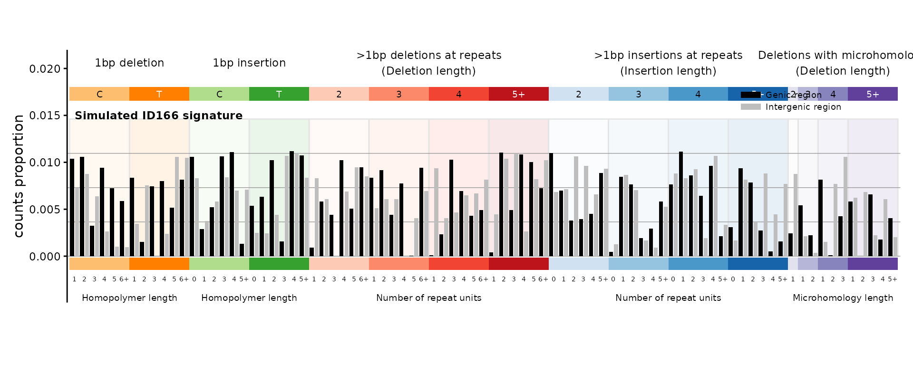

## SBS12 – strand bias summary

The SBS12 plot collapses a 192-channel catalog to 12 bars (6 mutation
classes x 2 strands) to visualize transcription strand bias.

``` r
plot_SBS12(catalog_sbs192, plot_title = "HepG2 -- SBS12 strand bias")
```

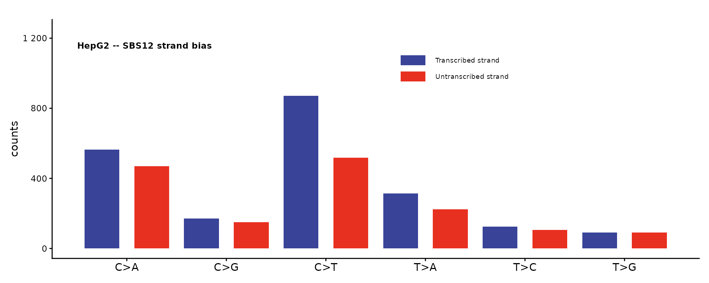

## Auto-dispatch with plot_guess()

If you don’t know (or don’t want to specify) the catalog type,
[`plot_guess()`](https://steverozen.github.io/mSigPlot/reference/plot_guess.md)
detects it from the number of rows:

``` r
plot_guess(catalog_sbs96, plot_title = "Auto-detected SBS96")
```

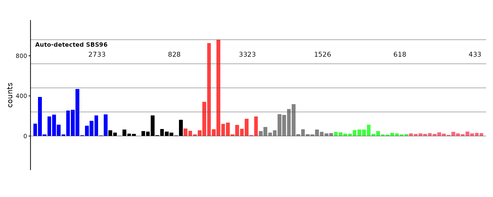

## Multi-sample PDF export

Every plot function has a `_pdf()` variant that writes a multi-page PDF
with 5 plots per page. The auto-dispatch version is
[`plot_guess_pdf()`](https://steverozen.github.io/mSigPlot/reference/plot_guess_pdf.md):

``` r
sbs96_mat <- as.matrix(sbs96_df[, 3:6])
rownames(sbs96_mat) <- catalog_row_order()$SBS96
colnames(sbs96_mat) <- paste0("Sample_", 1:4)

plot_guess_pdf(sbs96_mat, file.path(tempdir(), "sbs96_samples.pdf"))
```
