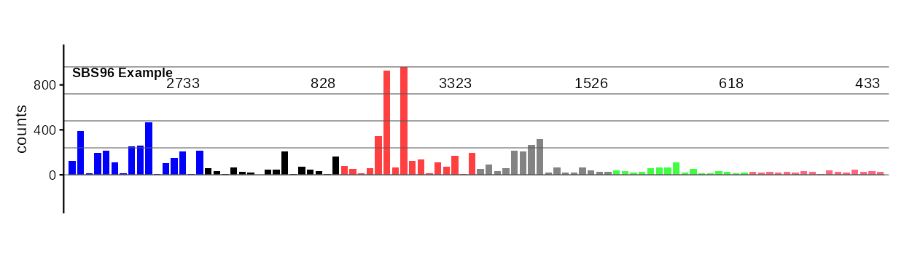
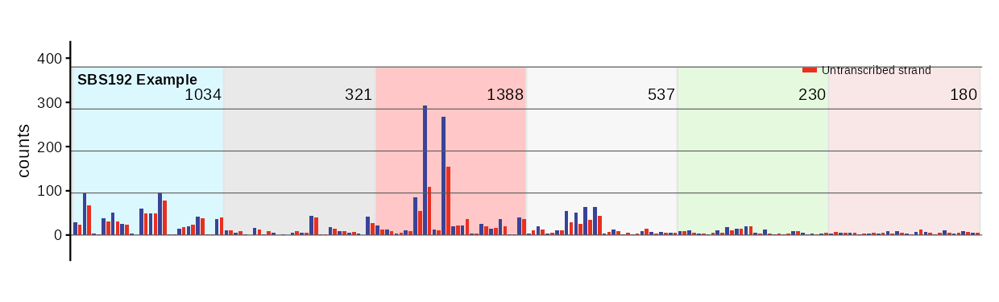
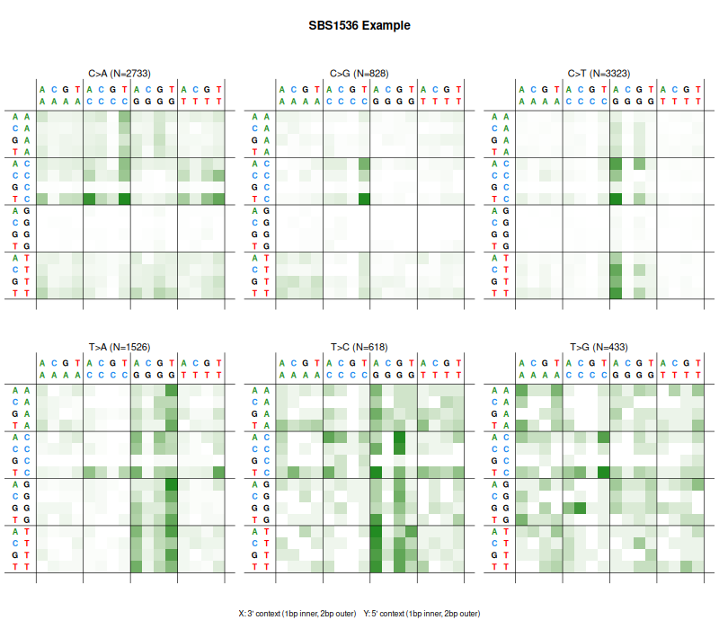
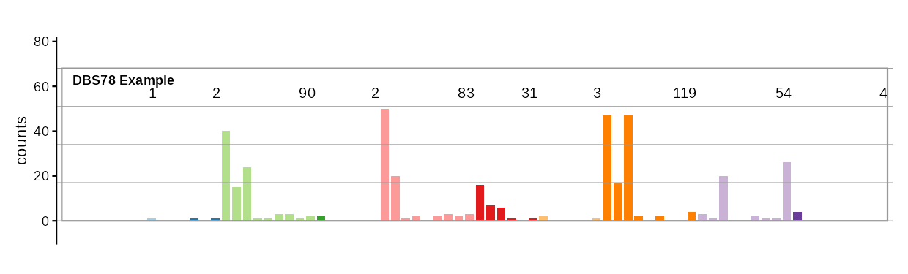
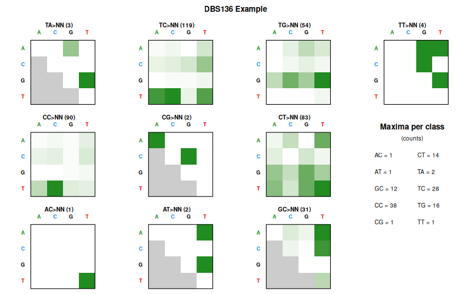
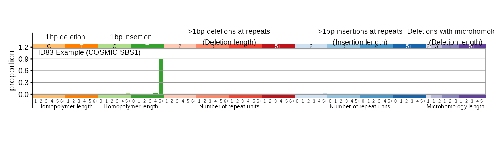
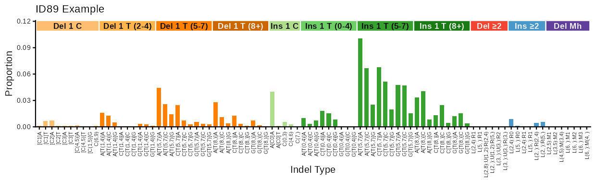
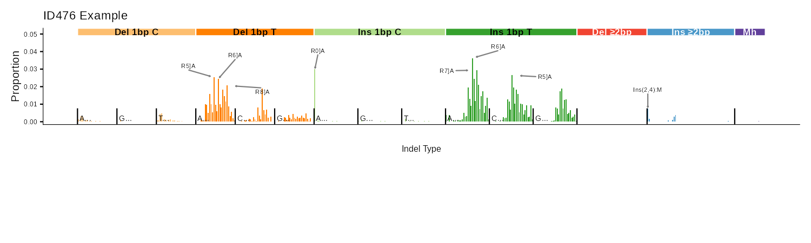

# mSigPlot

Publication-quality plots for mutational signatures and mutational
spectra. Supports SBS, DBS, and indel catalogs across 10 classification
systems with bar charts, strand-bias plots, and heatmaps.

## Installation

``` r
# Install from GitHub
install.packages("remotes")  # if needed
remotes::install_github("steverozen/mSigPlot")
```

## Quick start

Every plot function accepts a numeric vector, single-column data.frame,
matrix, tibble, or data.table. The easiest entry point is
[`plot_guess()`](https://steverozen.github.io/mSigPlot/reference/plot_guess.md),
which auto-detects the catalog type by row count:

``` r
library(mSigPlot)

# Auto-detect and plot
plot_guess(my_catalog)

# Or call a specific function
plot_SBS96(sbs96_catalog, plot_title = "Sample 1")

# Export multiple samples to a multi-page PDF (5 per page)
plot_guess_pdf(multi_sample_catalog, "output.pdf")
```

## Supported catalog types

| Channels | Function                                                                    | Mutation type                        | Plot style              |
|----------|-----------------------------------------------------------------------------|--------------------------------------|-------------------------|
| 96       | [`plot_SBS96()`](#sbs96)                                                    | SBS trinucleotide context            | Bar chart               |
| 192      | [`plot_SBS192()`](#sbs192)                                                  | SBS with transcription strand        | Paired bar chart        |
| 12       | [`plot_SBS12()`](https://steverozen.github.io/mSigPlot/man/plot_SBS12.Rd)   | SBS strand bias (from 192-row input) | Paired bar chart        |
| 1536     | [`plot_SBS1536()`](#sbs1536)                                                | SBS pentanucleotide context          | 2x3 heatmap grid        |
| 78       | [`plot_DBS78()`](#dbs78)                                                    | Doublet base substitution            | Bar chart               |
| 136      | [`plot_DBS136()`](#dbs136)                                                  | DBS dinucleotide classes             | 10-panel heatmap        |
| 144      | [`plot_DBS144()`](https://steverozen.github.io/mSigPlot/man/plot_DBS144.Rd) | DBS with transcription strand        | Paired bar chart        |
| 83       | [`plot_83()`](#id83)                                                        | Indel (COSMIC ID83)                  | Bar chart               |
| 89       | [`plot_89()`](#id89)                                                        | Indel (Koh classification)           | Bar chart               |
| 166      | [`plot_ID166()`](https://steverozen.github.io/mSigPlot/man/plot_ID166.Rd)   | Indel genic/intergenic               | Paired bar chart        |
| 476      | [`plot_476()`](#id476)                                                      | Indel with flanking base context     | Bar chart + peak labels |

Every plot function has a corresponding `_pdf()` variant (e.g.,
[`plot_SBS96_pdf()`](https://steverozen.github.io/mSigPlot/reference/plot_SBS96_pdf.md))
that writes multi-sample PDFs with 5 plots per page.

## Gallery

### SBS96

96-channel single base substitution profile with 6 color-coded mutation
classes (C\>A, C\>G, C\>T, T\>A, T\>C, T\>G).



### SBS192

Strand-aware SBS profile. Bars are paired: transcribed (blue) and
untranscribed (red) for each trinucleotide context.



### SBS1536

Pentanucleotide-context SBS shown as six 16x16 heatmaps.



### DBS78

78-channel doublet base substitution profile across 10 dinucleotide
reference classes.



### DBS136

DBS shown as 10 small 4x4 heatmaps, one per dinucleotide class, with a
maxima-per-class summary.



### ID83

COSMIC 83-channel indel classification covering 1bp
deletions/insertions, repeat-mediated indels, and microhomology-mediated
deletions.



### ID89

89-channel indel profile using the Koh et al. classification system.



### ID476

476-channel indel profile with flanking base context. Top peaks are
automatically labeled using ggrepel.



## Common parameters

All plot functions share these parameters:

| Parameter     | Description                                                      |
|---------------|------------------------------------------------------------------|
| `catalog`     | Numeric vector, data.frame, matrix, tibble, or data.table        |
| `plot_title`  | Title above the plot (defaults to column name)                   |
| `base_size`   | Base font size in points (default 11)                            |
| `show_counts` | `TRUE`/`FALSE`/`NULL` (auto-detect) for per-class count labels   |
| `ylim`        | Y-axis limits                                                    |
| `*_cex`       | Multipliers for individual text elements relative to `base_size` |

Bar chart functions also accept `grid`, `upper`, `xlabels`, and
`ylabels` toggles. See
[`?plot_SBS96`](https://steverozen.github.io/mSigPlot/reference/plot_SBS96.md)
for the full parameter list.

## Row name handling

If your catalog has row names matching the canonical mutation type
labels, mSigPlot validates and reorders them automatically. If row names
are absent (unnamed vector or sequential integer names), the data is
assumed to be in canonical order. Use
[`catalog_row_order()`](https://steverozen.github.io/mSigPlot/reference/catalog_row_order.md)
to inspect the expected order for any catalog type:

``` r
head(catalog_row_order()$SBS96)
#> [1] "ACAA" "ACCA" "ACGA" "ACTA" "CCAA" "CCCA"
```

## Documentation

After installation, access the full documentation for any function:

``` r
?plot_SBS96
?plot_guess
?catalog_row_order
```

## License

GPL (\>= 3)
